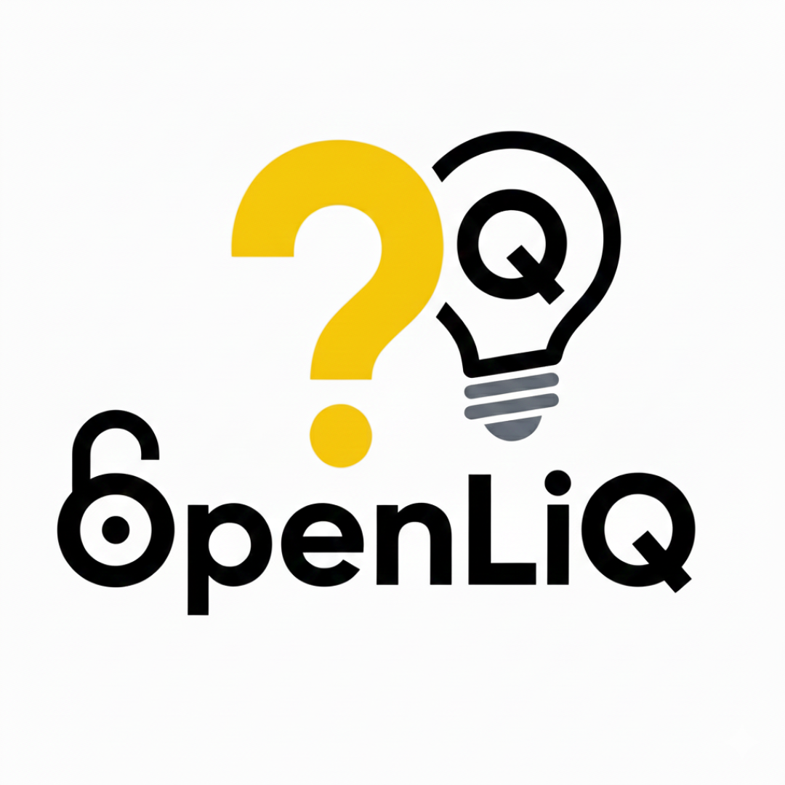

# OpenLiQ



OpenLiQ is a lightweight, local multiplayer quiz platform. Hosts can create a lobby, players can join with a PIN and nickname, select a quiz, and run through a short quiz while players answer in real time.

This repository contains a .NET backend and a Next.js frontend.

## Features

- Host creates a lobby and shares a 6-digit PIN with players
- Players join a lobby using PIN + nickname
- Host selects one of several quizzes
- Real-time gameplay using SignalR: questions, timers, answers
- 4 options per question, 20s timer per question
- Score tracking and final results shown to all players

## Quickstart (development)

Prerequisites

- Node.js 18+
- .NET SDK 8+

1. Clone the repository

```bash
git clone https://github.com/docVoid/OpenLiQ.git
cd OpenLiQ
```

2. Backend (API + SignalR hub)

```bash
cd backend/OpenLiQ.Api
dotnet restore
dotnet run
```

The backend runs the SignalR hub at `http://localhost:5000`.

3. Frontend (Next.js)

```bash
cd frontend
npm install
npm run dev
```

Open `http://localhost:3000` in your browser. Create a lobby as Host, share the PIN with players, let them join via `/player/join`, pick a quiz and start.

## Project structure

- `backend/OpenLiQ.Api` - .NET Web API + SignalR hub + in-memory game state service
- `frontend` - Next.js app with Host and Player views and SignalR client
- `docs` - assets and documentation

## Configuration

- Frontend uses `NEXT_PUBLIC_API_URL` to point to the backend SignalR hub, defaults to `http://localhost:5000`.
- Backend config in `appsettings.json` and `appsettings.Development.json`.

## License & Attribution

This project is licensed under the MIT License. See the [LICENSE](LICENSE)

**Attribution:** OpenLiQ — (c) docVoid

## Contributing

Contributions welcome — open issues or PRs.
